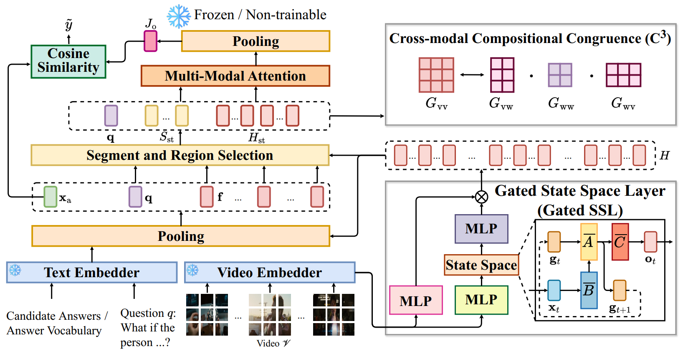

# Encoding and Controlling Global Semantics for Long-form Video Question Answering
<a href="https://nguyentthong.github.io/Long_form_VideoQA/" target="_blank"></a>
<a href="https://arxiv.org/abs/2405.19723" target="_blank"></a>
<a href="https://huggingface.co/datasets/thongnguyen5999/egoqa" target="_blank"></a>

A Pytorch Implementation of [[EMNLP 2024](https://arxiv.org/abs/2405.19723)] paper: Encoding and Controlling Global Semantics for Long-form Video Question Answering

 

## Prerequisites

The project requires the following:

1. **PyTorch** (version 1.9.0 or higher): The project was tested on PyTorch 1.11.0 with CUDA 11.3 support.
2. **Hardware**: We have performed experiments on NVIDIA GeForce A5000 with 24GB GPU memory. Similar or higher specifications are recommended for optimal performance.
3. **Python packages**: Additional Python packages specified in the `requirements.txt` file are necessary. Instructions for installing these are given below.

## Setup Instructions
Let's begin from creating and activating a Conda environment an virtual environment 
```
conda create --name gsmt_env python=3.7
conda activate gsmt_env
```
Then, clone this repository and install the requirements.
```
$ git clone https://github.com/zhiyuanhubj/Long_form_VideoQA.git
$ cd Long_form_VideoQA
$ pip install -r requirements.txt
```

## MAD-QA and Ego-QA datasets
We construct two novel datasets MAD-QA and Ego-QA for authentically long video question answering. In our experiments, we placed the downloaded data folder in the same root directory as the code folder. 

#### Question-and-Answer Annotations

We publish and maintain our datasets at [EgoQA@HF](https://huggingface.co/datasets/thongnguyen5999/egoqa) and [MADQA@HF](https://huggingface.co/datasets/thongnguyen5999/madqa)
.
#### Video Features

You can download the video features directly from our online drive: [Download from Google Drive](https://drive.google.com/drive/folders/1T22ixENJvTn6wrARj8KX5dr6hYsPB9D6?usp=drive_link)

## Training
With your environment set up and data ready, you can start training the model. To begin training, run the `egoqa_gsmt.sh` shell script located in the `shells\train` directory. 
```
./shells/train/egoqa_gsmt.sh
```
Alternatively, input the command below on the terminal to start training.
```
python main_egoqa.py --checkpoint_dir=egoqa \
	--feature_dir='./gsmt_data/feats/'  \
	--dataset=egoqa \
	--mc=5 \
	--bnum=5 \
	--epochs=30 \
	--lr=0.00004 \
	--qmax_words=30 \
	--amax_words=38 \
	--max_feats=32 \
	--batch_size=64 \
	--batch_size_val=64 \
	--num_thread_reader=8 \
	--mlm_prob=0 \
	--n_layers=2 \
	--embd_dim=512 \
	--ff_dim=1024 \
	--dropout=0.3 \
	--seed=400 \
	--topk-selector-dataloading 0 \
	--num-frames-in-feature-file 512 \
	--save_dir='./save_models/egoqa/gsmt_egoqa/''
```
Make sure to modify the `dataset_dir`, `feature_dir`, and `save_dir` parameters in the command above to match the locations where you have stored the downloaded data and features.

To verify that your training process is running as expected, you can refer to our training logs located in the `logs\` directory.

## Training

Upon finishing training the model, you can evaluate the model via running the `egoqa_gsmt.sh` shell script located in the `shells\test` directory.
```
./shells/test/egoqa_gsmt.sh
```

## Bibtex
```
@article{nguyen2024encoding,
  title={Encoding and Controlling Global Semantics for Long-form Video Question Answering},
  author={Nguyen, Thong Thanh and Hu, Zhiyuan and Wu, Xiaobao and Nguyen, Cong-Duy T and Ng, See-Kiong and Luu, Anh Tuan},
  journal={arXiv preprint arXiv:2405.19723},
  year={2024}
}
```
